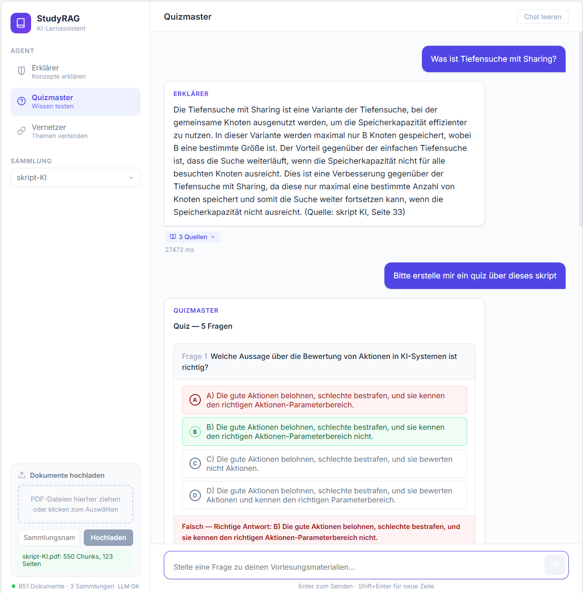

# StudyRAG: KI-Lernassistent mit RAG-Pipeline




Ein vollständig lokaler KI-Lernassistent, der Retrieval-Augmented Generation (RAG) nutzt, um Studierenden beim Verstehen von Vorlesungsmaterialien zu helfen – ohne Cloud-Abhängigkeit und mit vollständiger Datensouveränität.

---

## Architektur

```
┌─────────────────────────────────────────────────────────────────┐
│                        Streamlit Frontend                        │
│              (Chat UI, Upload, Agent-Auswahl)                   │
└────────────────────────┬────────────────────────────────────────┘
                         │ HTTP / REST
┌────────────────────────▼────────────────────────────────────────┐
│                    FastAPI Backend                               │
│  ┌─────────────┐  ┌──────────────┐  ┌─────────────────────┐   │
│  │  /api/upload│  │  /api/chat   │  │  /api/collections   │   │
│  └──────┬──────┘  └──────┬───────┘  └─────────────────────┘   │
│         │                │                                       │
│  ┌──────▼──────┐  ┌──────▼───────────────────────────────────┐ │
│  │  Ingestion  │  │           Retrieval Pipeline              │ │
│  │  Pipeline   │  │  ┌──────────────┐  ┌──────────────────┐  │ │
│  │             │  │  │ ChromaDB     │  │ Cross-Encoder    │  │ │
│  │ PDF Parser  │  │  │ Vector Store │→ │ Reranker         │  │ │
│  │ Chunker     │  │  └──────────────┘  └──────────────────┘  │ │
│  │ Embedder    │  └──────────────────────────┬────────────────┘ │
│  └─────────────┘                             │                   │
│                                    ┌─────────▼──────────┐       │
│                                    │      Agents         │       │
│                                    │  ┌───────────────┐  │       │
│                                    │  │  Erklärer     │  │       │
│                                    │  │  Quizmaster   │  │       │
│                                    │  │  Vernetzer    │  │       │
│                                    │  └───────┬───────┘  │       │
│                                    └──────────┼──────────┘       │
│                                               │                   │
│                                    ┌──────────▼──────────┐       │
│                                    │   Local LLM          │       │
│                                    │  (Mistral 7B GGUF)   │       │
│                                    └─────────────────────┘       │
└─────────────────────────────────────────────────────────────────┘
```

---

## Features

- **Erklärer-Agent**: Erklärt Konzepte aus Vorlesungsmaterialien auf Deutsch mit Quellenangaben. Antwortet nur auf Basis indexierter Dokumente und gibt ehrlich zu, wenn Informationen fehlen.
- **Quizmaster-Agent**: Generiert Multiple-Choice-Fragen zur Prüfungsvorbereitung. Gibt valides JSON mit Fragen, Antwortoptionen, richtiger Antwort und Erklärung zurück.
- **Vernetzer-Agent**: Findet Querverbindungen zwischen Konzepten aus verschiedenen Vorlesungen. Ideal für interdisziplinäres Lernen.
- **Vollständig lokale Ausführung**: Keine Daten verlassen den eigenen Server. Kein API-Key erforderlich.
- **Sicherheitsfeatures**: Prompt-Injection-Erkennung, Eingabelängenbegrenzung, Sliding-Window Rate Limiting.
- **GPU-Unterstützung**: CUDA-Beschleunigung via llama-cpp-python (optional, fällt auf CPU zurück).
- **Persistente Vektordatenbank**: ChromaDB speichert Embeddings dauerhaft – kein erneutes Indexieren nach Neustart.

---

## Tech Stack

| Komponente          | Technologie                                      |
|---------------------|--------------------------------------------------|
| LLM                 | Mistral-7B-Instruct-v0.3 (GGUF via llama-cpp)   |
| Embedding-Modell    | sentence-transformers/all-MiniLM-L6-v2           |
| Reranker            | cross-encoder/ms-marco-MiniLM-L-6-v2             |
| Vektordatenbank     | ChromaDB (persistent)                            |
| Backend             | FastAPI + Uvicorn                                |
| Frontend            | Streamlit                                        |
| PDF-Verarbeitung    | PyMuPDF (fitz)                                   |
| Text-Splitting      | LangChain RecursiveCharacterTextSplitter         |
| Containerisierung   | Docker + Docker Compose                          |
| Tests               | pytest                                           |

---

## Quickstart mit Docker

```bash
# 1. Repository klonen
git clone <repo-url> && cd studyrag

# 2. Modell herunterladen
huggingface-cli download TheBloke/Mistral-7B-Instruct-v0.3-GGUF \
    mistral-7b-instruct-v0.3.Q4_K_M.gguf --local-dir ./models

# 3. Konfiguration und Start
cp .env.example .env && docker compose up --build
```

Frontend: http://localhost:8501 | API-Docs: http://localhost:8000/docs

---

## Lokale Installation (ohne Docker)

### 1. Repository klonen

```bash
git clone <repo-url>
cd studyrag
```

### 2. Virtuelle Umgebung erstellen

```bash
python -m venv .venv
# Windows:
.venv\Scripts\activate
# Linux/macOS:
source .venv/bin/activate
```

### 3. Abhängigkeiten installieren

```bash
pip install --upgrade pip
pip install -r requirements.txt
```

Für GPU-Unterstützung (CUDA):

```bash
CMAKE_ARGS="-DLLAMA_CUBLAS=on" FORCE_CMAKE=1 pip install llama-cpp-python --force-reinstall --no-cache-dir
```

### 4. Modell herunterladen

```bash
huggingface-cli download TheBloke/Mistral-7B-Instruct-v0.3-GGUF \
    mistral-7b-instruct-v0.3.Q4_K_M.gguf \
    --local-dir ./models
```

### 5. Konfiguration

```bash
cp .env.example .env
# .env nach Bedarf anpassen (z.B. GPU-Layer, Chunk-Größe)
```

### 6. Backend starten

```bash
uvicorn src.main:app --host 0.0.0.0 --port 8000 --reload
```

### 7. Frontend starten (separates Terminal)

```bash
streamlit run frontend/app.py --server.port 8501
```

---

## Modell-Download

Das System ist für **Mistral-7B-Instruct-v0.3** im GGUF-Format optimiert:

```bash
# Mit huggingface-cli (empfohlen):
huggingface-cli download TheBloke/Mistral-7B-Instruct-v0.3-GGUF \
    mistral-7b-instruct-v0.3.Q4_K_M.gguf \
    --local-dir ./models

# Alternativ mit wget:
wget https://huggingface.co/TheBloke/Mistral-7B-Instruct-v0.3-GGUF/resolve/main/mistral-7b-instruct-v0.3.Q4_K_M.gguf \
    -P ./models/
```

Das Modell benötigt ca. 4,1 GB Speicher (Q4_K_M Quantisierung). Für bessere Qualität kann Q5_K_M (~5,1 GB) verwendet werden.

---

## API-Dokumentation

Die interaktive API-Dokumentation ist verfügbar unter:
- **Swagger UI**: http://localhost:8000/docs
- **ReDoc**: http://localhost:8000/redoc

### Endpunkte

| Methode | Pfad                          | Beschreibung                           |
|---------|-------------------------------|----------------------------------------|
| POST    | `/api/upload`                 | PDF hochladen und indexieren           |
| POST    | `/api/chat`                   | Frage an einen Agenten stellen         |
| GET     | `/api/collections`            | Alle Dokumentensammlungen auflisten    |
| DELETE  | `/api/collections/{name}`     | Sammlung löschen                       |
| GET     | `/api/health`                 | Systemstatus abrufen                   |

### Beispiel: Chat-Anfrage

```bash
curl -X POST http://localhost:8000/api/chat \
  -H "Content-Type: application/json" \
  -d '{
    "query": "Was ist der Unterschied zwischen Backpropagation und Gradient Descent?",
    "agent_type": "explainer",
    "collection_name": "machine_learning"
  }'
```

### Beispiel: PDF hochladen

```bash
curl -X POST http://localhost:8000/api/upload \
  -F "file=@./lecture.pdf" \
  -F "collection_name=machine_learning"
```

---

## Architektur-Entscheidungen

### Warum Mistral 7B?
Mistral 7B bietet ein exzellentes Verhältnis zwischen Modellgröße und Qualität. Das Instruct-Format mit `[INST]...[/INST]`-Tags ermöglicht präzise Anweisungsausführung. Die GGUF-Quantisierung ermöglicht den Betrieb auf Consumer-Hardware (8 GB VRAM oder ~12 GB RAM für CPU-Inference).

### Warum ChromaDB?
ChromaDB ist eine leichtgewichtige, einbettungsoptimierte Vektordatenbank mit persistenter Speicherung. Sie unterstützt mehrere Collections (eine pro Vorlesung), was thematisch getrennte Suche oder kollektionsübergreifende Suche ermöglicht. Keine separate Datenbankinfrastruktur erforderlich.

### Warum Cross-Encoder Reranking?
Bi-Encoder-Embeddings (für die initiale Suche) sind schnell, aber weniger präzise als Cross-Encoder, die Query und Dokument gemeinsam kodieren. Der zweistufige Ansatz (Bi-Encoder-Retrieval → Cross-Encoder-Reranking) kombiniert Effizienz mit hoher Präzision: 10 Kandidaten werden abgerufen, die 5 relevantesten werden behalten.

---

## Sicherheit

Das System implementiert mehrere Sicherheitsschichten:

1. **Prompt-Injection-Erkennung**: 20+ bekannte Angriffsmuster werden blockiert (case-insensitiv). Blockierte Anfragen werden geloggt.
2. **Eingabelängenbegrenzung**: Konfigurierbar (Standard: 2000 Zeichen), verhindert Token-Flooding.
3. **Sliding-Window Rate Limiting**: Konfigurierbar pro Minute (Standard: 30 Anfragen), thread-sicher implementiert.
4. **Input-Sanitisierung**: Kontrollzeichen und potenziell gefährliche Zeichenfolgen werden bereinigt.
5. **CORS-Konfiguration**: Im Produktionsbetrieb sollte `allow_origins` auf vertrauenswürdige Domains beschränkt werden.

---

## Übertragbarkeit

StudyRAG ist domänenunabhängig und kann für beliebige PDF-Dokumente eingesetzt werden:

- **Rechtswesen**: Gesetze, Urteile, Kommentare
- **Medizin**: Klinische Leitlinien, Fachliteratur
- **Unternehmensintern**: Handbücher, technische Dokumentation
- **Forschung**: Wissenschaftliche Paper, Berichte

Konfiguration über `.env`: Chunk-Größe, Modellpfad, Top-K-Parameter und Sprachmodell können ohne Codeänderung angepasst werden.

---

## Tests ausführen

```bash
pytest tests/ -v
```

Mit Coverage:

```bash
pip install pytest-cov
pytest tests/ -v --cov=src --cov-report=term-missing
```

---

## Lizenz

MIT License – siehe [LICENSE](LICENSE)

Copyright (c) 2024 StudyRAG Contributors
